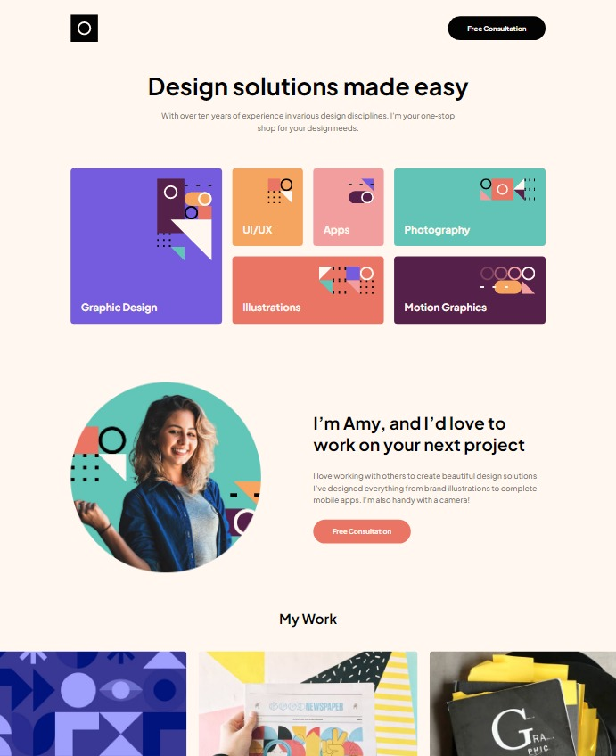

# Frontend Mentor - Single-page design portfolio solution

A solution provided by jefflangtech [Single-page design portfolio challenge on Frontend Mentor](https://www.frontendmentor.io/challenges/singlepage-design-portfolio-2MMhyhfKVo).

## Table of contents

- [Overview](#overview)
  - [The challenge](#the-challenge)
  - [Screenshot](#screenshot)
  - [Links](#links)
- [My process](#my-process)
  - [Built with](#built-with)
  - [What I learned](#what-i-learned)
  - [Continued development](#continued-development)
  - [Useful resources](#useful-resources)
- [Author](#author)

## Overview

### The challenge

Users should be able to:

- View the optimal layout for the site depending on their device's screen size
- See hover states for all interactive elements on the page
- Navigate the slider using either their mouse/trackpad or keyboard

### Screenshot

### Links

- Solution URL: [Frontend Mentor Solution](https://your-solution-url.com)
- Live Site URL: [JeffLangTech Github Repo](https://jefflangtech.github.io/design-portfolio/index.html)

## My process

### Built with

- Semantic HTML5 markup
- CSS custom properties
- Flexbox
- CSS Grid
- Vanilla JS

### What I learned

I took a lot of notes while I did this project. Check them out here: 
Project Notes: [Project Notes](./NOTES.md)

### Continued development

The practice of review, plan, note-taking worked really well. Still some details I missed and had to make little hot-fixes for because I didn't really feel like revamping a whole bunch of styling for my one error. But since that is the correct thing to do, and is also a big time waste, next time I hope to catch those details prior to getting myself stuck into a situation.

### Useful resources

- ChatGPT: really made a big difference in pointing me in the right direction, even if the code examples weren't quite right
- [Conor Bailey: Vanilla JavaScript Infinite Scrolling Image Slider](https://youtu.be/4UXJb4rjeDg) - Not exactly what I wanted but I need to enable scrolling with the keyboard or scroll wheel so I will be revisiting prior to submitting the solution

## Author

- Website - [JeffLangTech](https://jefflangtech.github.io/)
- Frontend Mentor - [@jefflangtech](https://www.frontendmentor.io/profile/jefflangtech)
- Twitter - [@jefflangtech](https://www.twitter.com/jefflangtech)